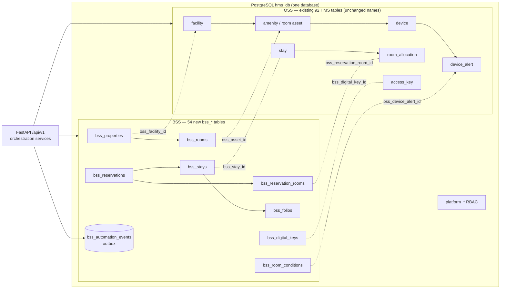

# New Platform Schema → HMS Integration Approach

**Date:** 2026-10-10
**Status:** Analysis and recommendation only. No code, migration, model or seed was changed.
**Inputs:**
- The new schema diagram (dbdiagram.io export, 88 tables), transcribed table by table in
  [NEW_SCHEMA_TRANSCRIPTION.md](NEW_SCHEMA_TRANSCRIPTION.md).
- The live HMS database `hms_db`: PostgreSQL 16, 92 tables, Alembic head `7c4e2b9a1d53`.
- [`backend/docs/PHASE1_7_DATABASE_IMPLEMENTATION.md`](../backend/docs/PHASE1_7_DATABASE_IMPLEMENTATION.md)
  and [`HMS_DATABASE_ANALYSIS_REPORT.md`](HMS_DATABASE_ANALYSIS_REPORT.md).

Evidence labels: **[FACT]** read from the diagram or the live database ·
**[INFER]** a reasoned conclusion · **[GAP]** something the diagram does not show and must be confirmed.

---

## 1. Recommendation in brief

1. **The new schema is not a replacement for the HMS database. It extends it.** **[FACT]**
   Every `oss_*` table in the diagram is an existing HMS table, under the same name with an `oss_` prefix and
   usually fewer columns. The genuinely new parts are the `bss_*` commercial/PMS layer (54 tables), the
   `platform_*` RBAC tables (3) and a small sustainability block (4).
2. **Keep the HMS database as the OSS layer, unchanged in place.** Do not rebuild it, rename its tables or
   drop the 65 HMS tables the diagram leaves out. Add the new tables alongside it in the **same PostgreSQL
   database** through normal, incremental Alembic migrations.
3. **Decide which layer owns each fact before writing any code.** OSS owns physical, IoT and operational
   truth: rooms as assets, devices, telemetry, alerts, locks. BSS owns commercial truth: reservations, rates,
   folios, payments, guests' PII, loyalty. The two layers are joined only by the cross-reference columns the
   diagram already defines (`bss_*_id` on OSS tables, `oss_*_id` on BSS tables). They never hold two editable
   copies of the same fact.
4. **Fix the diagram's defects before building** (§7): FK type mismatches, two competing role and user
   systems, an `oss_amenity.name` that is only 6 characters, and several hidden or cut-off columns.
5. **Deliver in phases, by business capability** (§8): foundation and RBAC first, then the property/room
   bridge, then reservations and stays (this finally gives the Bookings screen a real table), then billing,
   operations, loyalty/marketing and sustainability.

The timing is favourable: `hms_db` currently holds only seed/demo data (one facility,
"Ikanos Grand Chennai"), so no production data needs to be migrated. **[FACT]**

---

## 2. What the new schema contains

88 tables in four families. **[FACT]**

| Family | Tables | What it is |
|---|---:|---|
| `oss_*` (operations) | 27 | The HMS/Caleido operational model: organisation, facility, property tree, amenities (rooms), packages, users, roles, devices, MQTT, stays, keys, service and maintenance requests, invoice |
| `bss_*` (business) | 54 | A hotel PMS/commercial layer: brands, properties, rooms, rates, distribution, reservations, folios, payments, loyalty, marketing, housekeeping, work orders, smart access, audit, PII |
| `platform_*` | 3 | Module-based RBAC: `platform_modules`, `platform_permissions`, `platform_role_permissions` |
| Sustainability | 4 | `measurement_units`, `emission_factors`, `carbon_calculations`, `cm_points_ledger` |

### 2.1 The 54 BSS tables by capability

| Capability | Tables |
|---|---|
| Brand, property, rooms (7) | `bss_brands`, `bss_properties`, `bss_floors`, `bss_room_types`, `bss_rooms`, `bss_room_status_history`, `bss_room_device_registry` |
| Distribution and pricing (11) | `bss_booking_channels`, `bss_ota_channels`, `bss_property_channel_configs`, `bss_channel_inbound_reservations`, `bss_rate_plans`, `bss_rate_plan_room_types`, `bss_seasonal_rates`, `bss_availability_calendar`, `bss_cancellation_policies`, `bss_packages`, `bss_group_blocks` |
| Reservations and stays (4) | `bss_reservations`, `bss_reservation_rooms`, `bss_reservation_guests`, `bss_stays` |
| Guests and accounts (3) | `bss_guests`, `bss_guest_pii`, `bss_corporate_accounts` |
| Finance (7) | `bss_folios`, `bss_folio_charges`, `bss_orders`, `bss_payments`, `bss_invoices`, `bss_revenue_categories`, `bss_payment_methods_config` |
| Loyalty and marketing (10) | `bss_loyalty_programs`, `bss_loyalty_tiers`, `bss_loyalty_accounts`, `bss_loyalty_transactions`, `bss_promotions`, `bss_promo_redemptions`, `bss_campaigns`, `bss_campaign_enrollments`, `bss_events`, `bss_public_holidays` |
| Operations (7) | `bss_housekeeping_tasks`, `bss_service_requests`, `bss_maintenance_work_orders`, `bss_room_conditions`, `bss_digital_keys`, `bss_smart_access_log`, `bss_iot_control_events` |
| Staff and governance (5) | `bss_users`, `bss_roles`, `bss_audit_trail`, `bss_pii_access_log`, `bss_automation_events` |

### 2.2 Two conventions in one diagram

| | OSS tables | BSS tables |
|---|---|---|
| Primary key | `id varchar(36)` (a UUID as text) | `<entity>_id bigint`, plus a separate `uuid char(36)` unique column |
| Audit columns | `created_on` / `updated_on` | `created_at` / `updated_at` (often only `created_at`) |
| Status | `status int` | `status varchar(20)` |
| Flags | `int` or `boolean` | `int` |

The column types (`datetime`, `int` flags, `json`, `char(36)` for UUIDs) are **MySQL-style** **[INFER]**.
HMS runs on PostgreSQL with native `UUID`, `TIMESTAMPTZ`, `BOOLEAN`, `JSONB` and ENUM types. §6 sets the
translation rules.

---

## 3. How the new schema maps onto the current HMS database

### 3.1 The 27 OSS tables already exist in HMS **[FACT]**

| Diagram table | HMS table today | What the diagram adds |
|---|---|---|
| `oss_organisation`, `oss_facility`, `oss_property_type`, `oss_property`, `oss_property_chain` | same names | nothing |
| `oss_amenity_type`, `oss_amenity`, `oss_package`, `oss_department`, `oss_mqtt_broker`, `oss_mqtt_topic` | same names | nothing |
| `oss_device_type`, `oss_device`, `oss_device_command`, `oss_device_alert` | same names | nothing (but see the type conflicts in §7) |
| `oss_device_stat` | `device_stat` | `unit_id` → `measurement_units` |
| `oss_app_user` | `app_user` | `user_type`, `is_hms_staff`, `bss_legacy_user_id` |
| `oss_role` | `role` | `module_id` |
| `oss_user_role` | `user_role` (composite PK) | a surrogate `id`, `module_id`, `granted_by`, `granted_at` |
| `oss_stay` | `stay` | `bss_stay_id` |
| `oss_room_allocation` | `room_allocation` | `bss_reservation_room_id` |
| `oss_stay_user` | `stay_user` | `bss_stay_id` |
| `oss_access_key` | `access_key` | `bss_digital_key_id` |
| `oss_lock_activity_log` | `lock_activity_log` | nothing |
| `oss_service_request` | `service_request` | `bss_service_request_id` |
| `oss_invoice` | `invoice` | `bss_invoice_id` |
| `oss_maintenance_request` | `maintenance_request` | `bss_work_order_id` |

The diagram also **omits columns that HMS has**. For example, `stay.comments` and
`stay.checkout_initiated_by`, `device.part_number` and `device.model`, and `service_request.promo_code_id`
are all missing. **[FACT]** Read the OSS boxes as an abbreviated view. They are not an instruction to drop
columns. **[INFER — confirm with the schema author]**

### 3.2 65 HMS tables are not in the diagram

These cover service catalogues, incidents, value alerts, notifications, activity feeds, the scheduler, job
orders, firmware, device parameters, energy stats and others. The OSS boxes still **reference** several of
them: `job_function_id`, `category_id`, `device_param_id`, `alert_type`, `command_type`, `key_type` and
`currency_id` all point at HMS lookup tables that the diagram does not draw. **[FACT]** So these tables stay.
Only these have a direct counterpart in the new design:

| HMS today | New counterpart | Recommendation |
|---|---|---|
| `role_module`, `role_module_permission` | `platform_modules`, `platform_permissions`, `platform_role_permissions` | Replace, but carry over the 17 existing module names as `module_code` (§8, Phase 1) |
| `promo_code` (Offers screen) | `bss_promotions` | BSS owns commercial promotions. Keep `promo_code` only for in-stay service offers, or migrate it (decision D6) |
| `occasion` (Holidays screen) | `bss_public_holidays` | Decision D6 |
| `facility_event` (Events screen) | `bss_events` | Decision D6 |
| `energy_stat` | `carbon_calculations` input | Keep. It is the energy source that carbon calculations read |

---

## 4. Where the two layers overlap

Most of the integration risk is here. In each row both layers model the same real-world thing, and one of
them has to be the system of record.

| Concept | OSS (HMS) | BSS | Recommended owner | Link |
|---|---|---|---|---|
| Hotel | `facility` | `bss_properties` | **OSS** for identity. BSS adds commercial attributes (brand, star rating, timezone, check-in time) | `bss_properties.oss_facility_id` |
| Building / floor | `property` + `property_chain` | `bss_floors` | **OSS** (it drives the device and room tree) | add `bss_floors.oss_property_id` **[GAP]** |
| Room | `amenity` (room-type amenities) | `bss_rooms` + `bss_room_types` | **OSS** for the physical asset, **BSS** for sellable inventory | `bss_rooms.oss_asset_id` → `amenity.id` |
| Room state | `amenity.status`, `is_dnd` | `bss_rooms.housekeeping_status`, `occupancy_status`, `bss_room_status_history` | Split: **occupancy** derived from `bss_stays`; **housekeeping** from `bss_housekeeping_tasks`; `amenity.status` becomes a projection written only by the orchestration service | — |
| Booking | `stay` (one row per booking, `no_of_rooms`) | `bss_reservations` | **BSS** | `stay.bss_stay_id` as drawn, but see §7 C5 |
| Room on a booking | `room_allocation` | `bss_reservation_rooms` | **BSS** | `room_allocation.bss_reservation_room_id` |
| In-house stay | `stay` timestamps, `stay_user` | `bss_stays` (one row per room) | **BSS** for the commercial lifecycle; OSS keeps the operational copy for devices and keys | `stay_user.bss_stay_id` |
| Guest | `app_user` (`is_staff = 0`) | `bss_guests` + `bss_guest_pii` | **BSS** for profile and PII; `app_user` stays as the guest's *app login* | add `bss_guests.oss_app_user_id` **[GAP]** |
| Staff login | `app_user` (`is_staff = 1`) | `bss_users` | **OSS `app_user`** (see C3) | `app_user.bss_legacy_user_id` |
| Roles / RBAC | `role`, `user_role`, `role_module*` | `bss_roles` + `platform_*` | **`role` + `platform_*`**; drop `bss_roles` (see C2) | `platform_role_permissions.role_id` → `role.id` |
| Package | `package` (room/amenity package) | `bss_packages` (rate-plan package) | Different concepts with the same name. Keep both and rename in the UI/API to avoid confusion | — |
| Service request | `service_request` | `bss_service_requests` (SLA) | **OSS** for execution (mobile/staff app); **BSS** for SLA and guest-facing tracking | `service_request.bss_service_request_id` |
| Maintenance | `maintenance_request` | `bss_maintenance_work_orders` | **OSS** for execution; BSS for the work-order record | `maintenance_request.bss_work_order_id` |
| Invoice | `invoice` | `bss_folios` → `bss_invoices` | **BSS**. `invoice` becomes read-only and legacy once folios go live | `invoice.bss_invoice_id` |
| Digital key | `access_key`, `lock_activity_log` | `bss_digital_keys`, `bss_smart_access_log` | **OSS** issues keys to locks. BSS stores the guest-facing credential and the audit trail | `access_key.bss_digital_key_id`, `bss_digital_keys.oss_device_id` |
| Device ↔ room | `device.amenity_id` | `bss_room_device_registry` | **OSS**. The registry is a read model that BSS keeps in sync | `registry.oss_device_id` |
| Device command | `device_command` | `bss_iot_control_events` | **OSS** executes; BSS records who asked and why | `iot_control_events.oss_device_id` |
| Device alert | `device_alert` | `bss_room_conditions` | **OSS** raises; BSS turns it into a room condition or work order | `room_conditions.oss_device_alert_id` |

There is a further clue that `app_user` should stay the single staff identity. **[FACT]** Every BSS
"who did it" column (`assigned_to`, `changed_by`, `created_by`, `accessed_by`, `calculated_by`) is
`varchar(36)`, which is the OSS user id format. None of them is the `bigint` key of `bss_users`.

---

## 5. Recommended architecture



### 5.1 One database, not two

The diagram draws real foreign keys across the layers, for example `bss_rooms.oss_asset_id` and
`bss_room_device_registry.oss_device_id`. Those are only enforceable inside one database. A separate BSS
database or service would turn every one of them into an unenforced id plus a sync job, which is more moving
parts for a single-team product. **Recommendation: one PostgreSQL database, one Alembic history, one
SQLAlchemy `Base`.** **[INFER]**

### 5.2 Naming: keep the diagram's names for new tables; do not rename HMS tables

- New tables use the diagram's names exactly (`bss_reservations`, `platform_modules`,
  `carbon_calculations`), so the diagram stays the shared map between teams.
- HMS tables keep their current names. Read `oss_` as a documentation label, mapped 1:1 in §3.1.
  Renaming 92 tables would touch every model, the schema test suite and every analysis document, with no
  functional gain.
- *Alternative:* PostgreSQL schemas (`oss`, `bss`, `platform`). This is cleaner long term, but `Base`
  currently pins one schema globally (`backend/app/db/base.py`), and Alembic would need
  `include_schemas`. Revisit it once the integration is stable.

### 5.3 How the layers stay consistent

1. **Synchronous orchestration for user actions.** Check-in, check-out, room move, key issue and folio
   posting are each a single service function that writes both layers inside one transaction, using the
   existing `writes.transaction()` pattern in `backend/app/services/writes.py`. Example check-in:
   `bss_stays` → `stay` / `room_allocation` → `access_key` → `bss_digital_keys` → `bss_room_status_history`.
2. **Outbox for device-driven and asynchronous flows.** `bss_automation_events` (`trigger_type`,
   `source_table`, `source_id`, `target_table`, `target_id`, `processed_at`, `status`) is a transactional
   outbox **[INFER]**. Flows such as *device alert → room condition → work order* or *checkout → housekeeping
   task* write an event in the same transaction. A worker then processes it, built on the existing
   `scheduler_job` tables or a small background process.
3. **One writer per fact.** Where the diagram caches state on both sides, only the owner in §4 writes it,
   and the other side is a projection. Examples are `bss_room_device_registry.last_known_health_status` and
   `amenity.status`.
4. **Reconciliation report.** A scheduled read-only check that lists divergence: rooms whose occupancy
   disagrees with in-house stays, links that are set on one side only, and devices missing from the
   registry. This directly addresses the "two sources of truth" finding in
   `HMS_DATABASE_ANALYSIS_REPORT.md`, which this design would otherwise make three.

### 5.4 Application code layout (when building starts)

Follow the existing layering (`model → service → route → api binding → hook → page`), with a separate
package per layer:

```
backend/app/models/bss/          one module per capability in §2.1
backend/app/models/platform.py
backend/app/models/sustainability.py
backend/app/services/bss/        reads, plus *_write.py inside writes.transaction()
backend/app/services/orchestration/   check-in, check-out, key issue, folio posting
backend/app/api/v1/endpoints/bss_*.py
```

---

## 6. Type and convention translation (diagram → PostgreSQL)

| Diagram | PostgreSQL in HMS | Note |
|---|---|---|
| `varchar(36)` id or FK (OSS) | `UUID` | HMS already does this |
| `bigint` PK (BSS) | `BIGINT GENERATED ALWAYS AS IDENTITY` | Keep the BSS design: internal bigint key plus public `uuid` |
| `uuid char(36)` | `UUID NOT NULL UNIQUE DEFAULT gen_random_uuid()` | **The API exposes `uuid` only, never the bigint**, which matches HMS's UUID-only API today |
| `datetime` | `TIMESTAMPTZ`, stored in UTC | Convert with `bss_properties.timezone` for display |
| `int` flag (`is_active`, `is_void`) | `BOOLEAN` | |
| `json` | `JSONB` | |
| `status varchar(20)` | PostgreSQL ENUM | HMS already has 34 ENUM types; keep that convention |
| `decimal(15,4)` money | `NUMERIC(15,4)` plus a `char(3)` currency | |
| `created_at` / `updated_at` | Keep as drawn on BSS tables | Add `updated_at` wherever a row is mutable but the diagram omits it |
| Encrypted PII (`*_encrypted text`, `email_hash`) | `TEXT`, encrypted in the application; `email_hash` = SHA-256 for lookup | Key management is decision D5 |

---

## 7. Defects in the diagram to fix before building

| # | Severity | Issue | Fix |
|---|---|---|---|
| C1 | High | **FK type mismatches.** `oss_device.device_type` is `int` but `oss_device_type.id` is `varchar(36)`. `bss_room_conditions.oss_device_alert_id` and `bss_maintenance_work_orders.oss_alert_id` are `varchar(36)`, but `oss_device_alert.id` is `bigint`. | Use HMS's real types: `device_type.id` SMALLINT and `device_alert.id` BIGINT |
| C2 | High | **Three role systems.** `oss_role` / `oss_user_role`, `bss_roles`, and `platform_role_permissions`, which points at `oss_role`. Module ids also appear on `oss_role`, `oss_user_role` *and* `platform_permissions`. | One role table (`role`); permissions only through `platform_role_permissions`; drop `bss_roles` and both `module_id` columns |
| C3 | High | **Two staff identities.** `bss_users` (bigint, MFA, lockout) next to `oss_app_user`. HMS Web auth uses `app_user` today, and every BSS actor column is a varchar(36) OSS id. | Keep `app_user` as the identity. Move the MFA and lockout columns onto it (or into a `user_security` table). Use `bss_users` only as a one-off legacy import, if at all |
| C4 | High | **`bss_audit_trail.record_id` and `bss_automation_events.source_id`/`target_id` are `bigint`**, so they cannot hold an OSS UUID. Auditing or eventing an OSS row is impossible as drawn. | Make them `varchar(36)` or `TEXT` (or a UUID plus a bigint pair) |
| C5 | High | **Stay cardinality.** `stay` is one row per booking (`no_of_rooms`), while `bss_stays` is one row per room (`room_id NOT NULL`). Yet `oss_stay.bss_stay_id` is drawn 1:1. | Link `stay` ↔ `bss_reservations` (add `stay.bss_reservation_id`) and `stay_user` ↔ `bss_stays`. Drop `stay.bss_stay_id` |
| C6 | Medium | `oss_amenity.name` is `varchar(6)`. Room names such as "Room 201" or "Conference Hall" do not fit. | Keep HMS's current length |
| C7 | Medium | `bss_rooms.oss_facility_id` has no FK, and it repeats information already reachable through `property_id → bss_properties.oss_facility_id`. | Drop it, or add the FK |
| C8 | Medium | **Floors are not linked** to the OSS property tree, and guests are not linked to `app_user`. | Add `bss_floors.oss_property_id` and `bss_guests.oss_app_user_id` (nullable) |
| C9 | Medium | **Tenancy scope unclear.** `bss_guests`, `bss_corporate_accounts`, `bss_booking_channels`, `bss_revenue_categories` and `bss_payment_methods_config` have no property or brand column. HMS already has a cross-facility scoping gap. | Decide: brand-level, property-level or global (decision D4) |
| C10 | Low | `bss_reservations` has both `status` and `status_cancelled`. `bss_availability_calendar.rooms_available` is a nullable derived value. | Fold cancellation into `status`; make `rooms_available` a generated column |
| C11 | Low | Many BSS tables have `created_at` but no `updated_at`, even though their rows change (status, `is_active`). | Add `updated_at` |
| C12 | — | **Unreadable in the image:** 8 column names in `bss_promotions` are covered by the `bss_roles` box; about 7 trailing rows of `bss_maintenance_work_orders` are covered by `cm_points_ledger`; `bss_room_device_registry` may be missing a trailing column; the `bss_service_requests` header is partly hidden. | **Get the source `.dbml` / SQL export from dbdiagram.io.** It removes every transcription doubt in one step |

---

## 8. Phased delivery plan

Each phase is self-contained. It gets its own Alembic revision(s), model and service and route changes,
tests, seed update and frontend work, and it leaves the app releasable. Size: S = days, M = 1–2 weeks,
L = 2–4 weeks for one developer. **[INFER]**

| Phase | Scope | Key work | Size |
|---|---|---|---|
| **0. Confirm** | Decisions in §9; obtain the DBML; fix §7 in the diagram | No code. Output: a corrected, agreed diagram | S |
| **1. Foundation and RBAC** | `platform_*` tables; translation conventions; ENUMs | Create `platform_modules` seeded with today's 17 module names **as `module_code`**, so `frontend/src/core/rbac/modules.ts` keeps working unchanged. Migrate `role_module_permission` rows into `platform_role_permissions`. Switch `/auth/me` effective permissions to read from `platform_*`. Retire `role_module*` one release later | M |
| **2. Property and room bridge** | `bss_brands`, `bss_properties`, `bss_floors`, `bss_room_types`, `bss_rooms`, `bss_room_device_registry`, `bss_room_status_history` | Backfill one brand, one property linked to the facility, floors from the property tree, rooms from room-type amenities (`oss_asset_id`), and the registry from `device.amenity_id`. Add the reconciliation report | M |
| **3. Reservations and stays** | `bss_reservations`, `bss_reservation_rooms`, `bss_reservation_guests`, `bss_stays`, `bss_guests`, `bss_guest_pii`, rate plans, cancellation policies, availability | Bridge columns on `stay`, `room_allocation`, `stay_user`. **Orchestration services** for book, check-in, check-out and room move. The **Bookings** screen gets a real backing table (today it has none). Occupancy screens read occupancy from `bss_stays` | L |
| **4. Billing** | `bss_folios`, `bss_folio_charges`, `bss_orders`, `bss_payments`, `bss_invoices`, `bss_revenue_categories`, `bss_payment_methods_config` | Post service charges (`service_request.net_amount`) to folios. `invoice` becomes read-only with `bss_invoice_id`. Payment gateway integration is a separate project | L |
| **5. Operations crossover** | `bss_housekeeping_tasks`, `bss_service_requests`, `bss_maintenance_work_orders`, `bss_room_conditions`, `bss_digital_keys`, `bss_smart_access_log`, `bss_iot_control_events`, `bss_automation_events` | Outbox worker. Flows: device alert → room condition → work order; checkout → housekeeping task; key issue → `access_key` plus `bss_digital_keys` | L |
| **6. Commercial extensions** | Loyalty (4), promotions and redemptions, campaigns (2), corporate accounts, group blocks, events, public holidays, channels and OTA (4), seasonal rates | Resolve the Offers, Holidays and Events screens against the BSS tables (decision D6). Treat OTA inbound processing as its own integration | L |
| **7. Sustainability** | `measurement_units`, `emission_factors`, `carbon_calculations`, `cm_points_ledger`; `device_stat.unit_id` | A scheduled calculation from `energy_stat` × emission factor, per room and per stay | M |
| **Cross-cutting** | `bss_audit_trail`, `bss_pii_access_log` | Audit through SQLAlchemy session events from Phase 1 onward; PII access logging from Phase 3, when PII first exists | — |

### 8.1 Rules for every phase

- **Additive first.** New tables and nullable link columns come first. Switching reads to the new owner
  comes next. Removing the old path comes one release later. No destructive migration ships in the same
  release as the code that stops using the old path.
- **Tests:** extend `APPROVED_TABLES` and the schema test (the live DB must equal the approved set); add
  integration tests for every orchestration function; add tests that the reconciliation report finds
  nothing on fresh seed data.
- **Seed:** update `seeds/run_seed` in each phase so a fresh database always has a consistent pair of OSS
  and BSS rows. Prefer **re-seeding** over backfilling the current demo data.
- **API:** expose BSS rows by `uuid` and keep the current `/api/v1` error envelope and pagination.
  `/api/v1/bss/...` or capability names (`/reservations`, `/folios`) both work; pick one in decision D7.

---

## 9. Decisions needed before Phase 1

| # | Decision | Recommendation |
|---|---|---|
| D1 | Are the `oss_*` boxes the full OSS model, or an abbreviated view of HMS? | Abbreviated. Keep all 92 HMS tables and columns |
| D2 | Target database engine: the diagram reads as MySQL | PostgreSQL 16, as today |
| D3 | Single staff identity: `app_user` or `bss_users`? | `app_user` (C3) |
| D4 | Tenancy level for guests, corporate accounts, channels, revenue categories, payment methods | Brand-level for guests and corporate accounts; property-level for the rest |
| D5 | PII encryption: application keys or `pgcrypto`, and where the key lives | Application-level encryption with the key in a secret store, never in `.env` in git |
| D6 | Offers / Holidays / Events: stay on `promo_code` / `occasion` / `facility_event`, or move to BSS? | Move to BSS in Phase 6. Until then, keep the current tables untouched |
| D7 | API naming for BSS resources | Capability names (`/reservations`, `/folios`), matching existing routes |
| D8 | Stay linkage (C5) | `stay` ↔ `bss_reservations`, and `stay_user` ↔ `bss_stays` |

---

## 10. Risks

| Risk | Impact | Mitigation |
|---|---|---|
| Room state ends up with three sources (`amenity.status`, `bss_rooms.*_status`, stay timestamps) | Wrong occupancy on the dashboard and for devices | Single-writer rule (§5.3) plus the reconciliation report |
| RBAC migration breaks login or screen visibility | Users locked out | Seed `module_code` equal to today's `module_name`; run old and new permission reads in parallel for one release |
| Transcription errors from the image | Wrong columns built | Build from the DBML export only (C12) |
| Scope size: 61 new tables | A long, unreleasable branch | Ship by phase; every phase is usable on its own |
| PII introduced without controls | Compliance exposure | Encryption, `bss_pii_access_log` and role-gated endpoints arrive in the same phase as the PII tables (Phase 3) |
